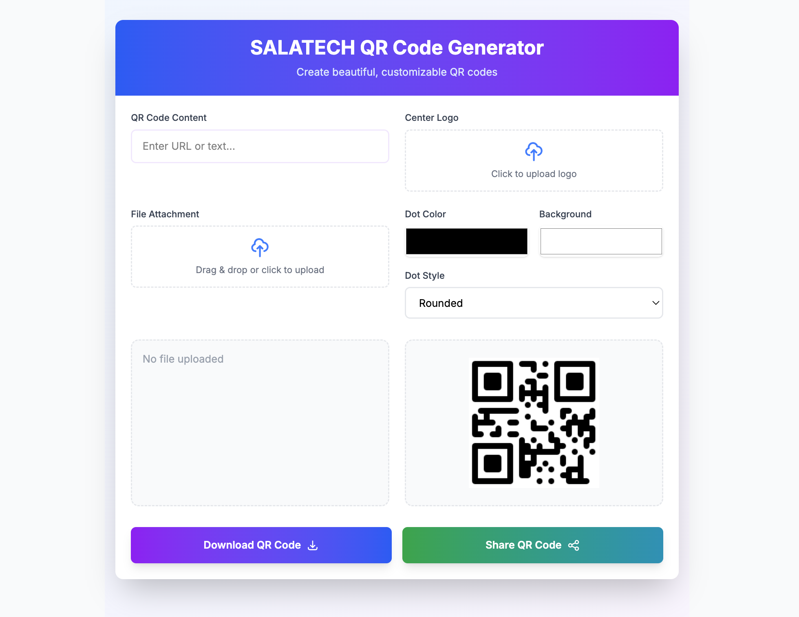

# SALATECH QR Code Generator

A modern, responsive QR code generator with advanced styling options and sharing capabilities.



## Features

- 🎨 **Customizable Designs**
  - Choose from 6 dot styles (rounded, dots, classy, etc.)
  - Custom dot and background colors
  - Add center logo/image
- 📁 **File Attachment Support**
  - Attach images, videos, audio, or PDFs
  - Automatic Cloudinary upload
- ✨ **Responsive Design**
  - Works on all screen sizes
  - Mobile-friendly interface
- ✨ **Advanced Features**
  - Real-time QR preview
  - Download as PNG
  - Native sharing capability
  - Smooth animations with Framer Motion
- ☁️ **Cloud Integration**
  - Cloudinary media storage
  - Secure file uploads

## Installation

1. **Prerequisites**
   - Node.js (v16+)
   - npm (v8+)
   - Cloudinary account (free tier)

2. **Clone Repository**
   ```bash
   git clone https://github.com/yourusername/salatech-qr-generator.git
   cd salatech-qr-generator

3. **Install Dependencies**
    ```bash
    npm install

4. **.env.local**
    ```bash
    NEXT_PUBLIC_CLOUDINARY_CLOUD_NAME=your_cloud_name
    NEXT_PUBLIC_CLOUDINARY_UPLOAD_PRESET=your_upload_preset

5. **Run Development Server**
    ```bash
    npm run dev
